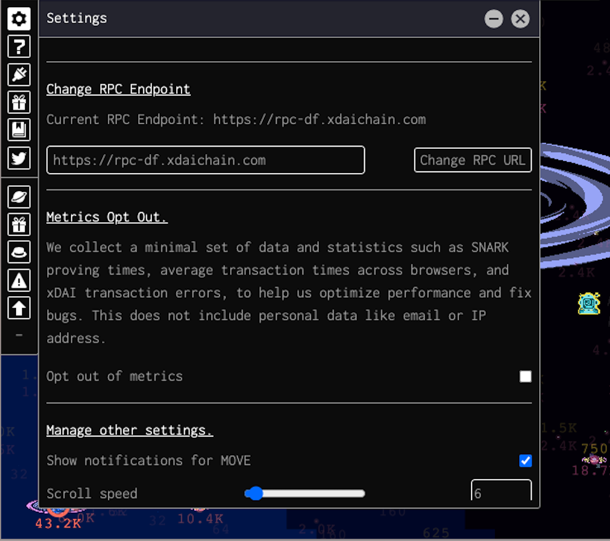

# Changing your RPC endpoint

You can change the RPC endpoint that the Dark Forest client connects to in the settings pane of the game.

- In addition to the game default xDAI-provided [https://rpc-df.xdaichain.com](https://rpc-df.xdaichain.com) endpoint, xDAI also provides a number of other [public endpoints](https://www.xdaichain.com/for-developers/developer-resources).
- You can also run your own node locally [or on the cloud](./running-your-own-xdai-node.md)
- Cloud providers like [Quicknode](https://www.quicknode.com/) will run a node for you with a few clicks for a monthly fee.
- Last but not least, [Pocket Network](https://www.blog.pokt.network/darkforest/) has gifted the Dark Forest community an xDAI RPC load-balanced endpoint node at [https://poa-xdai.gateway.pokt.network/v1/lb/60b13899d3279c22da2a444d](https://poa-xdai.gateway.pokt.network/v1/lb/60b13899d3279c22da2a444d)
