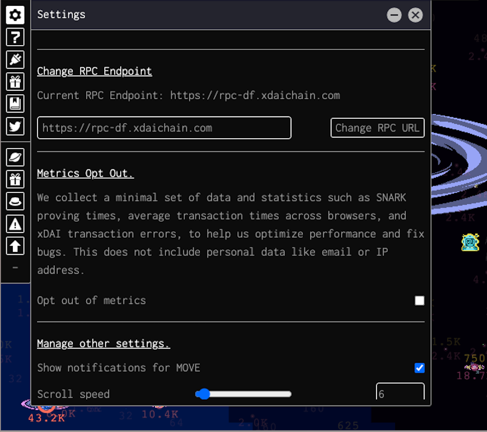

# Changing your RPC endpoint

You can change the RPC endpoint that the Dark Forest client connects to in the settings pane of the game.

In addition to the xDAI-provided [https://rpc-df.xdaichain.com](https://rpc-df.xdaichain.com) endpoint, xDAI also provides a number of other [public endpoints](https://www.xdaichain.com/for-developers/developer-resources).

