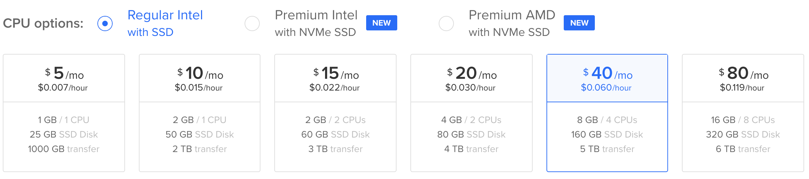
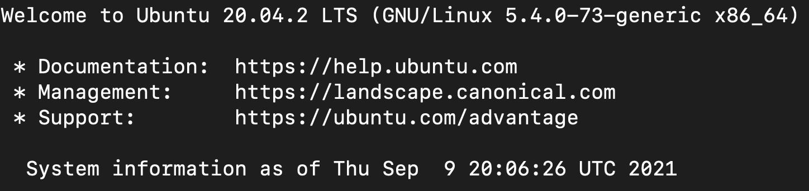
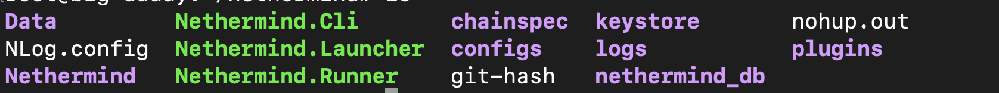
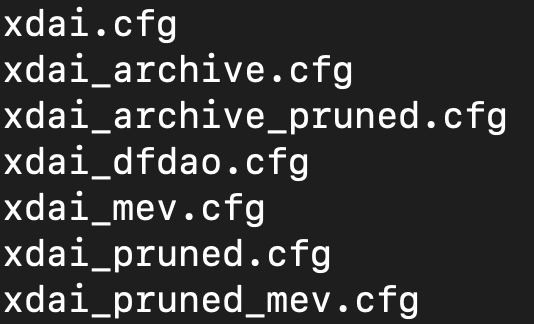
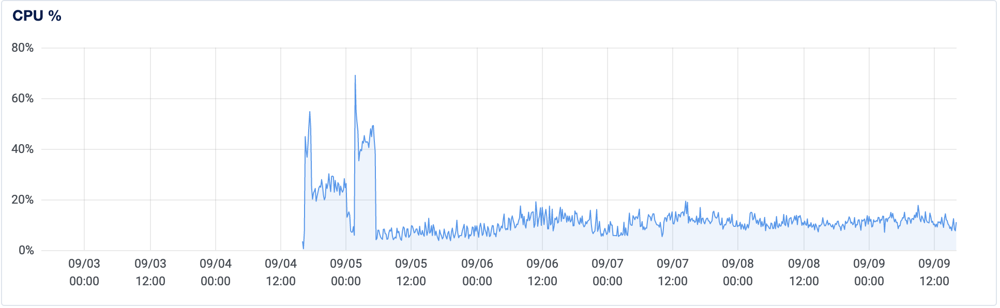
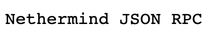
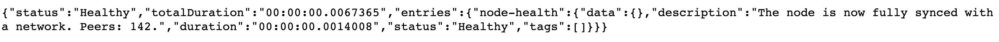

# How to run your own xDai Node on Digital Ocean

Welcome! cha0sg0d here. I'm a Dark Forest player and [dfdao](https://twitter.com/d_fdao) member. Here are the steps I took to sync an xDai node using the Nethermind client on a Digital Ocean instance.

### Why run your own xDai Node?
- No queue of other people's transactions
- No downtime. Thousands of other players are attempting to use the same free rpc endpoint as you otherwise!
- Faster access. The memory and cpu speed of the free rpc is not published. By running your own node you can use a beefier box. 

The clients that have known xDai support include [OpenEthereum](https://www.xdaichain.com/for-developers/install-xdai-client/parity) (formerly Parity) and [Nethermind](https://www.xdaichain.com/for-developers/install-xdai-client/nethermind). 

### Why Nethermind

from xDai [docs](https://www.xdaichain.com/for-developers/install-xdai-client/nethermind)
> A majority of xDai validators are now running the Nethermind client. The latest version includes support for MEV via flashbots and increased default xDAI TxPool size from 1024 transactions to 2048.

### Why Digital Ocean for hosting
from Nethermind [docs](https://docs.nethermind.io/nethermind/first-steps-with-nethermind/hardware-requirements)
> Generally the faster IO operations the better. For this reason Digital Ocean and UpCloud are so far the best cloud providers we have tested when running Nethermind nodes.

### 1. Setting up a Digital Ocean Instance
1. Buy a droplet (cloud computer). I recommend a machine with *at least* the following specs ($40/month):
    * `Ubuntu 20.4 / 8 GB / 4 CPUs 160 GB SSD Disk 5 TB transfer`
    * If this too slow, I synced a node in ~6 hours with the $80/month option
      > If your sync is very slow (extended beyond two days) then very likely your setup cannot catch up with the chain progress.
    * 

2. Remotely [connect](https://docs.digitalocean.com/products/droplets/how-to/connect-with-ssh/) to the Droplet using ssh. Probably something like `ssh root@157.245.5.42`
* You should see the following on success:
* 

### 2. Install Nethermind and dependencies

*Note: these commands are verbatim from [here](https://docs.nethermind.io/nethermind/ethereum-client/running-nethermind/running-the-client)*


1. `wget [NETHERMIND_URL]` - use amd64 release from [downloads](https://downloads.nethermind.io/))
2. ```sudo apt-get update && sudo apt-get install libsnappy-dev libc6-dev libc6 unzip -y``` - Linux dependencies
3. `unzip NETHERMIND_URL -d nethermind` - unzip to nethermind folder
4. `cd nethermimd`

At this point, I diverged from the basic installation. This is because there are some specific configuration settings that are nice for running a node (and playing Dark Forest). 

### 3. Configure Nethermind for Dark Forest

So in the `nethermind` folder you will see `Nethermind.Launcher` and `Nethermind.Runner`.

* 

From [ethhub](https://docs.ethhub.io/using-ethereum/ethereum-clients/nethermind/)

> Nethermind.Launcher is an interactive prompt that allows you to choose the network which then calls Nethermind.Runner with the appropriate config file. This is the quickest way to get up and running.
> Nethermind.Runner is the actual client binary similar to the geth binary and supports both cli options or a JSON configuration file. `Nethermind.Runner --config <path_to_config>`

I added some custom configurations, so I choose to use the `Nethermind.Runner` binary with my custom config file.

1. `cd nethermind/configs` 
  * We want to sync an xDai node, so here are the options for xDai (xdai_dfdao is my custom config): 
  * 
  * I choose to copy `xdai_pruned_mev.cfg` because:
    1. I want the experiment with [mev](https://www.xdaichain.com/for-developers/developer-resources/mev-and-flashbots) on xDai
    2. I want to save size by pruning, at the cost of historical queries:  
        > pruning is the process of removing some of the intermediary state nodes - it saves some disk space but makes most of the historical state queries fail.

2. `cp CONFIG_FILE YOUR_CONFIGNAME`
  * for me, this was `cp xdai_pruned_mev.cfg xdai_dfdao.cfg`

Edit your config. Here is [mine](https://gist.github.com/cha0sg0d/0c633efcb11db3b869a4450fb6035d7d) for reference.
1. `JSONRPC: {"Enabled": true}`
2. `JSONRPC: {"Host": DIGITAL_OCEAN_PUBLIC_IP}`
  * These commands allow you to access your node from the Internet.
3. `Network: {"ActivePeersMaxCount": 256}`
      > if you have a good connection and a reasonable machine then setting --Network.MaxActiveSyncPeers to 256 (see NetworkConfig secion in configuration) should give much better fast sync times (we use 256 peers to get 5 hours syncs)
      * Note that even though `ActivePeersMaxCount` is [deprecated](https://docs.nethermind.io/nethermind/ethereum-client/configuration/network), this setting worked for me (and `MaxActiveSyncPeers`) didn't.

### 4. Run Nethermind in background

So now we're ready to go. 

However, if you run `./Nethermind.Runner --config <path-to-config-file>` and logout, your process will stop.

To avoid this, you can use [nohup](https://www.geeksforgeeks.org/nohup-command-in-linux-with-examples/) and the `&` operator to run your process in the background.

1. `nohup ./Nethermind.Runner --config <path-to-config-file> &`
2. optional: If you want to enable Health [Checks](https://docs.nethermind.io/nethermind/ethereum-client/monitoring-node-health), run the following:
  * `nohup ./Nethermind.Runner --config <path-to-config-file> --HealthChecks.Enabled true &`

This command will create a new file `nohup.out` (name can be configured with `nohup ... > output.txt`) in the `nethermind` directory, with logs that you can inspect. 

You can also check out the Digital Ocean Droplet Activity Dashboard, which should show a large increase in activity while syncing occurs.



3. Go to `http://DIGITAL_OCEAN_IP:8545` and you should see the following:
  * 

### 5. Inspect logs and check node's health

Logs are in two places: `nohup.out` (or whatever you name your output file) and `nethermind/logs/xdai.logs.txt`.

I inspected both sets of logs with the `cat filename` command
and once the file got too big `tail -n 10 filename` to view the newest entries.

Nethermind provides an excellent [explanation](https://docs.nethermind.io/nethermind/first-steps-with-nethermind/getting-started#explaining-nethermind-logs) of what the logs are telling you about the speed of your fast sync.

I suggest following along and learning about the logs.

Finally, once your node is synced or near synced, you can confirm your node is in good shape:

`http://DIGITAL_OCEAN_IP:8545/health`



**Thanks for reading!**

If this was helpful, say thanks on [twitter](https://twitter.com/cha0sg0d11).