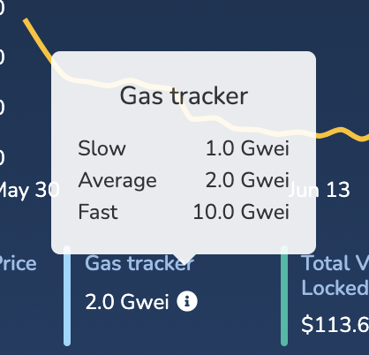

# What is gas?

Blockchains are a marketplace where you pay to have your transaction included. When the market is full there are two options. You can wait it out and not submit any transactions until the price falls, or you can overpay so your transactions are chosen over someone elses.

Gas is priced in GWei, a subunit of the network token (in this case xdai). There are 1,000,000,000 GWei in 1 xdai. Different types of transactions take longer to process and run for longer on the blockchain. So a Dark Forest Move might take 1million gas, other actions are smaller at 100k gas, some larger, like minting nfts.

One xdai is always worth 1 dollar. So an average transaction might be 1 million gas, if you set your gas to 1 gwei, then  1/1,000,000,000 * 1gwei * 1,000,000 = 0.001 xdai or 1/10 of a penny.

Depending on the conditions, Dark Forest generally airdrops you a nickel to play the game. You can see how under low congestion conditions this could give you ~50 moves.

However if your transactions arent going through you might raise your gas bid to 10 gwei. Now  1/1,000,000,000 * 10 gwei * 10000000 = 0.01 xdai or 1 penny. Now you can only make ~5 moves before you run out of free Dark Forest airdrop.

So you can see the trouble here, you want to constantly monitor what the going rate is and decide how much above that youd like to stay in order to prioritize your transactions.

The rolling average of gas costs can be found on [blockscout](https://blockscout.com/xdai/mainnet) by hovering over gas tracker.

You want to be setting your gas to at least average. However everyone else is also checking this number and pushing their price up, so you might want to always be 1.1 * avg or something. Fast on the otherhand is computed to get you into the next block hopefully gauranteed.

You can set your gas per transaction in the Dark Forest settings menu.