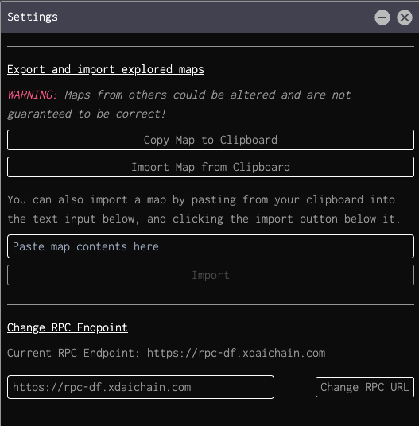

# Sharing map data

As your miner uncovers regions of the universe, your webclient will save information associated with these uncovererd regions to your browser's local storage.

Dark Forest saves data to IndexedDB. You can copy a JSON representation of your full map data to your clipboard through the settings pane. You can also use the settings pane to import a map from your clipboard (or by copying map data into the text box shown below.)

A community plugin also exists that allows you to [export snippets of your map](https://github.com/darkforest-eth/plugins/blob/master/content/utilities/map-export/plugin.js).

## Map JSON Structure
