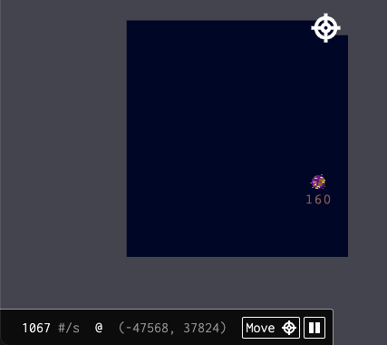
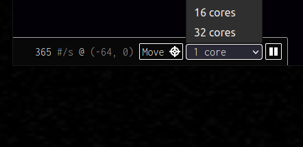
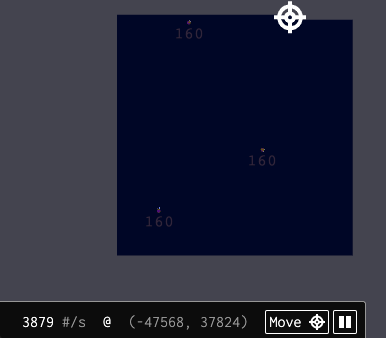

# What is mining?

Dark Forest's key mechanic is its cryptographic _fog of war_. When you first join the game, you have no information on where other players are located.

Players must compute hashes in order to uncover points of interest in the universe, such as the locations of planets and other players. These hashes are saved to your browser's local storage, and are considered secret data.

By default, the Dark Forest default web client uses a single-threaded Javascript miner to explore the universe, but there are a number of things that you can do to increase your hashrate.

You can set your webclient to use additional cores next to the play pause mining button. The performance of your miner will plateau if you try to set the number of cores to be greater than your computer's actual number of cores.

Community-maintained headless miner implementations, such as [mimc-fast](https://github.com/projectsophon/darkforest-rs/tree/main/mimc-fast) (and a [complimentary client plugin](https://github.com/darkforest-eth/plugins/blob/master/content/productivity/remote-explore/plugin.js)), are available online.

