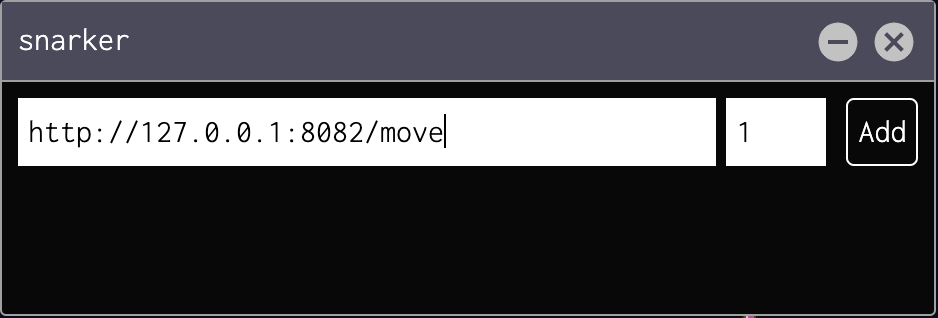

# Running a remote SNARKer

Dark Forest is powered by ZK-Snark technology, a cryptographic technique that can be used to prove the correctness of a function without revealing the inputs or logic of the function.

Dark Forest uses this technique to verify moves within the game are valid without revealing the location of planets to folks snooping on-chain. This technique (Zk-snark Proof Generation) is computationally expensive!  Let's move that computation outside of your browser instance.

## Dependencies

- Node.js: install [node.js v.14](https://nodejs.org/en/download/)
- Git: follow instructions [here](https://git-scm.com/book/en/v2/Getting-Started-Installing-Git)

## Installing on a Local Server (Mac, Unix)

First, get a copy of the code from Github.

`git clone https://github.com/Bind/df-snarker`

Enter the df-snarker directory.

`cd df-snarker`

Install code dependencies from NPM.

`npm install`

Start the server.

`npm run start`

If you are running the server on your machine with the default configuration you can click [here](http://localhost:8082) to verify it's working! You should see `v.6 Round 1 Dark Forest Snarking Server` in your browser.
  
## Connecting to server

- Copy the remote snarker plugin code from the [plugins repository](https://github.com/darkforest-eth/plugins/blob/master/content/productivity/remote-snarker/plugin.js)

- Add the IP address or the URL of the machine running the server into the plugin and set the concurrency to 1. (You can set the concurrency higher if you have a very powerful machine).

That is it! You should be generating your move snarks outside of your browser.

## Troubleshooting

Like the remote miner, if your server doesn't have an ssl cert (it probably doesn't) then you need to enable mixed content in your browser.

Be sure to disable adblockers as they can block outbound requests from the browser to the server, causing moves to fail!

If you are running the snarking server on the same machine as your browser be sure to use `http://` not `https://` when connecting to it!
